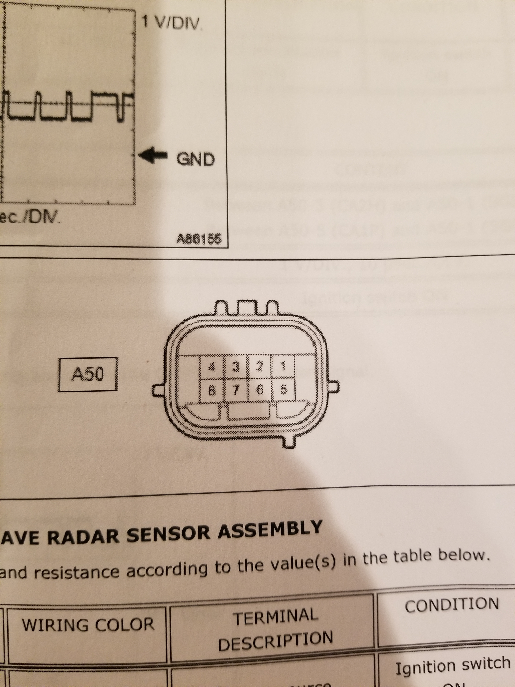

# Toyota Radar Toolkit

[](https://www.python.org/downloads/)
[](LICENSE)
[](https://www.raspberrypi.org/)
[](https://www.morningstar.com/news/marketwatch/20251003175/the-ai-bubble-is-17-times-the-size-of-the-dot-com-frenzy-and-four-times-subprime-this-analyst-argues)

Utilities for bringing up, visualizing, and experimenting with Toyota millimeter‑wave radar modules over CAN. The repository focuses on a reusable radar driver that can be embedded in other projects, plus two ready‑to‑run examples. It builds upon the excellent work in [frk2/toyoyta_radar_control_can](https://github.com/frk2/toyoyta_radar_control_can).

## Repository Layout

- `toyota_radar_driver.py` – modular radar driver that:
  - Optionally configures the CAN interfaces (`ip link set …`).
  - Loads the Prius ADAS and PT DBC files to decode radar tracks and keep the radar awake.
  - Sends the wake-up burst and runs a keep-alive loop on the vehicle bus.
  - Exposes decoded track data via callbacks and a cached `get_tracks()` API.
- `radar_curses.py` – terminal (curses) visualization of radar targets using the shared driver.
- `radar_callbacks.py` – minimal callback example that logs tracks and prints periodic summaries.
- `toyota_radar_debug.py` / `toyota_radar_rpi.py` – earlier standalone scripts kept for reference; they directly manage CAN buses without the new driver abstractions.
- `fix_dbc.py` and the `opendbc/` submodule – helper tooling and DBC definitions pulled from Comma.ai’s OpenDBC project.

## Requirements

- Python 3.8+
- [`python-can`](https://python-can.readthedocs.io/) with SocketCAN support on Linux.
- [`cantools`](https://cantools.readthedocs.io/) for DBC decoding.
- Toyota radar hardware connected via two CAN channels (`car` bus and `radar` bus).

Install Python dependencies with:

```bash
python3 -m pip install -r requirements.txt  # create one if needed
```

If you do not maintain a `requirements.txt`, install ad hoc:

```bash
python3 -m pip install python-can cantools
```

## CAN Interface Setup

All scripts assume two SocketCAN interfaces, typically `can0` (car bus) and `can1` (radar bus), at 500 kbps. The driver can optionally bring the interfaces up for you; otherwise run:

```bash
sudo ip link set can0 type can bitrate 500000
sudo ip link set can1 type can bitrate 500000
sudo ip link set can0 up
sudo ip link set can1 up
```

Hardware varies by install (e.g., Waveshare Dual CAN Hat on a Raspberry Pi). Ensure the radar’s radar-bus pair is wired to the `radar_channel` and the car-bus pair to the `car_channel`.

### Radar Connector Pinout



| Pin | Signal            |
|----:|-------------------|
| 1   | GND               |
| 2   | Car CAN Low       |
| 3   | Car CAN High      |
| 5   | Radar CAN High    |
| 6   | Radar CAN Low     |
| 8   | +12 V VCC         |

The examples in this repository assume:

- Car CAN (pins 2/3) → `can0`
- Radar CAN (pins 5/6) → `can1`
(if it doesn't work, flip can0 and can1)

## Using the Radar Driver

```bash
python3 radar_callbacks.py
```

This starts the driver, registers a simple logging callback, and prints a running summary. Key flags:

- `--radar-channel` / `--car-channel` – override SocketCAN interface names.
- `--radar-dbc` / `--control-dbc` – use alternate DBCs.
- `--no-setup` – skip `ip link` configuration if you manage it externally.
- `--no-keepalive` – disable the internal keep-alive loop if another ECU already satisfies the radar.

To embed in another project:

```python
from toyota_radar_driver import ToyotaRadarDriver, ToyotaRadarConfig

config = ToyotaRadarConfig()
driver = ToyotaRadarDriver(config)

def on_track(track):
    print(track.track_id, track.long_dist, track.lat_dist)

driver.register_track_callback(on_track)
driver.start()
```

Call `driver.stop()` during shutdown to tear down threads and CAN handles.

## Curses Visualization

```bash
python3 radar_curses.py
```

The UI shows a plan-view grid of targets and a textual panel with distances, lateral offsets, relative speed, and track age. Press `q` to exit. Tune layout/behavior with flags such as `--max-long`, `--max-lat`, and `--refresh-hz`.

## Legacy Scripts

`toyota_radar_debug.py` and `toyota_radar_rpi.py` remain for reference. They predate the modular driver, print raw traffic, and send static spoofing frames.

## Development Notes

- The repo tracks the OpenDBC submodule; run `git submodule update --init --recursive` after cloning.
- Avoid running multiple radar scripts simultaneously — only one process should own the CAN buses.
- When modifying the driver, keep the callback API stable so dependent apps only need to register hooks.

Contributions welcome: file issues or PRs for additional vehicles, visualizations, or integrations.
